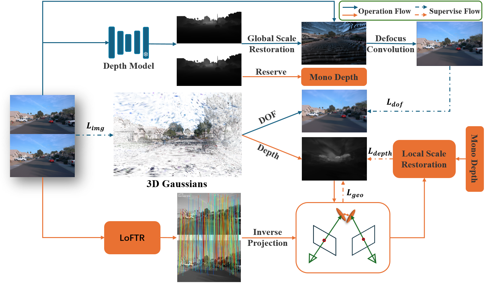

# Depth-Consistent 3D Gaussian Splatting

**Depth-Consistent 3D Gaussian Splatting via Physical Defocus Modeling and Multi-View Geometric Supervision**

## Abstract

Three-dimensional reconstruction in scenes with extreme depth variations remains challenging. This work proposes a novel framework integrating depth-of-field supervision and multi-view consistency supervision to advance 3D Gaussian Splatting. Our method achieves superior depth fidelity through:
- Scale-recovered monocular depth estimation with defocus convolution
- LoFTR-based semi-dense feature matching for cross-view consistency
- Unified defocus physics with multi-view geometric constraints

**Key Achievement**: 0.8 dB PSNR improvement over state-of-the-art on Waymo Open Dataset.

## Pipeline



Our framework consists of two core components:
- **Depth-of-Field Supervision (Blue Flow)**: Addresses inaccuracies in distant scenes through physical defocus modeling
- **Multi-View Consistency Supervision (Orange Flow)**: Enforces cross-view geometric alignment via semi-dense matching

## Acknowledgments

We gratefully acknowledge the foundational work of [3D Gaussian Splatting](https://github.com/graphdeco-inria/gaussian-splatting) by Kerbl et al., upon which this research builds.

## Publication

```bibtex
@misc{deng2025depthconsistent3dgaussiansplatting,
      title={Depth-Consistent 3D Gaussian Splatting via Physical Defocus Modeling and Multi-View Geometric Supervision}, 
      author={Yu Deng and Baozhu Zhao and Junyan Su and Xiaohan Zhang and Qi Liu},
      year={2025},
      eprint={2511.10316},
      archivePrefix={arXiv},
      primaryClass={cs.CV},
      url={https://arxiv.org/abs/2511.10316}, 
}
```
